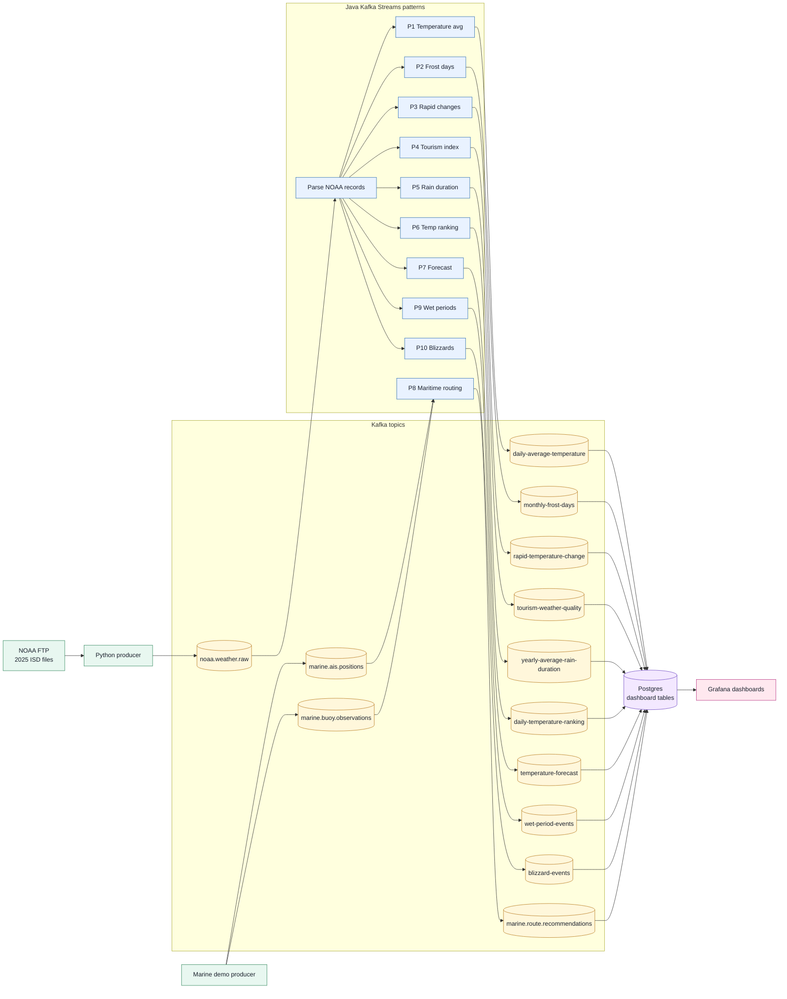

# fhv-ss26-stream-processing
Repo Description: Processing NOAA weather data with Kafka.

## Architecture



## Ideas to poll the data via FTP
- Kafka Connect with FTP Source Connector
  - is probably not good because of licensing issues
- Custom Python script that reads the historical data and sends it to Kafka
  - is probably the most flexible, then we can track which archive files were already processed and resume without sending duplicates for completed files

### Doing some Research
Questions:
- What's the difference between Kafka Topics and Streams?
  - Kafka Topics are the basic unit of data storage in Kafka, they are like a log where producers write data and consumers read data. Streams are a higher-level abstraction that allows you to process data in real-time as it flows through Kafka, they provide a way to perform operations on the data such as filtering, mapping, and aggregating.

### Setting up Kafka
- We use the Kafka Docker image to set it up locally on each machine 
  - We have two Macs and two Windows machines in our team, so containerization is probably a good idea.
- Which NOAA data do we use?
  - There is no live 2026 dataset for our use case, so we read the historical data from 2025.
  - The producer reads the NCEI archive from `ftp.ncei.noaa.gov` at `/pub/data/noaa/2025`.
  - The historical 2025 archive is about 1.5 GB in total.


## Run the Starter Container
```powershell
$env:STREAM_PATTERN='temperature,rain-duration'
docker compose up --build -d
```

The producer reads historical NOAA ISD station-year files for 2025 and writes JSON messages to Kafka topic `noaa.weather.raw`.

To read messages:
```powershell
docker compose exec kafka /opt/kafka/bin/kafka-console-consumer.sh --bootstrap-server kafka:19092 --topic noaa.weather.raw --from-beginning
```

## Java Kafka Streams Client
The Maven project in `patterns` consumes the NOAA Kafka topic, deserializes the JSON envelope, parses the text payload.

Defaults:
- Kafka bootstrap server: `localhost:19094`
- Input topic: `noaa.weather.raw`
- Output topic for daily averages: `noaa.weather.daily-average-temperature`

Run it from `patterns`:
```powershell
mvn exec:java
```

For a fresh `KAFKA_STREAMS_APPLICATION_ID`, the stream starts at the beginning of the topic so it can process the already-produced 2025 historical data. So, every time the Java application is started, the full data from Kafka is reprocessed.

## Learnings during development
- When running multiple patterns at once, the disk usage and sometimes CPU usage is quite high. So, a parameter for running only a specific pattern was added.


## Grafana Dashboard
The Compose setup includes Postgres and Grafana for visual monitoring:

- Grafana: http://localhost:3000
- Login: `admin` / `admin`
- Dashboard: `NOAA / NOAA Kafka Stream Processing`
- Postgres host port: `15432`

The Java stream client writes dashboard data into Postgres while it consumes Kafka:

- `noaa_stream_counts`: total raw Kafka messages and total parsed/usable observations.
- `noaa_daily_station_average`: one row per station and day with the average temperature in Celsius.

Start the dashboard stack:
```powershell
docker compose up --build kafka postgres grafana noaa-stream-client
```

The dashboard service uses `KAFKA_STREAMS_APPLICATION_ID=noaa-weather-dashboard`. If you need to rebuild the dashboard from existing Kafka data again, change that value to a new id or reset the consumer group before restarting the service.

The dashboard contains:
- `Raw Requests`: total records read from `noaa.weather.raw`.
- `Parsed Requests`: total records successfully parsed and usable for temperature averages.
- `Daily Average Temperature Per Station`: line plot with 2025 days on the x-axis and one station series per `station_id`.

Check ingestion progress:
```powershell
.\scripts\check-ingestion.ps1
```

The producer does not keep the 2025 gzip files on disk. It streams each archive file from NOAA FTP, writes each decoded observation into Kafka, and records completed/partial file progress in the `producer_state` Docker volume. A full run is done when the checkpoint shows all NOAA archive files completed. The NCEI 2025 directory currently lists about 12,815 station-year gzip files, so a few thousand Kafka records means only the first station file has been processed.

## Task Distribution
round robin with:
- 1 Florian, 2 Chris, 3 Mykola, 4 Haroldas

# Patterns
## Pattern 1: compute the average temperatures for each stations per day in 2025 (Florian)
thoughts:
- Python is no option (further info from Haroldas) --> Java (especially with Java/Kafka Streams) is used.
- Where should parsed data go? --> Into a new topic `noaa.weather.parsed` with a more structured format (e.g. JSON with fields for station, date, temperature, etc.)
- How to visualize the results? --> I created an optional Grafana dashboard. That also needs a postgres db for storing/caching the aggregated data.


## Pattern 2: count frost days per station and month in 2025 (Chris)
thoughts:
- Similar to pattern 1, but instead of averaging values I count predicate hits with `temp < 0C`.
- To avoid overcounting, multiple frost measurements on the same station and day are counted only once, then aggregated per month.
- Predicate-based count: count distinct frost days per station and month in 2025.
- had to force recreate to only run one pattern at a time:
- Grafana dashboard for it: `NOAA Frost Days 2025`

```powershell
$env:STREAM_PATTERN='frost-days'
docker compose up --build -d --force-recreate noaa-stream-client
```


## Pattern 3: rapid temperature change detection (Haroldas)
thoughts:
- Implemented as summary statistics on time-dependent functions over a sliding window.
- Calculates the rate of temperature change (°C/h) between consecutive readings for each station.
- Aggregates these rates over a window (default 24h) to find the minimum, maximum, and average rate of change.
- Useful for detecting sudden warming or cooling events that could indicate passing weather fronts.
- Dashboard: `NOAA Rapid Temperature Change 2025`
```powershell
$env:STREAM_PATTERN='rapid-temperature-change'
docker compose up --build -d --force-recreate noaa-stream-client
```

## Pattern 4: tourism weather quality index (Mykola)
thoughts:
- Implemented a regional Tourism Weather Quality Index.
- The NOAA ISD ingest gives us temperature, wind speed, and visibility distance, so these are real input dimensions for the score.
- The pattern idea mentions sunshine. NOAA ISD does not provide direct sunshine duration in the mandatory part we parse, so we use visibility as a practical sky clarity proxy instead of a fake placeholder. Visibility is converted to `sky_clarity_score` from 0 to 100, where 10 km or more means very clear.
- Regions are derived from the NOAA ISD station history metadata. If a station has `country_code` and `state_code`, the region becomes `country-state`, for example `US-CA` / `United States / CA`; otherwise it uses the country, for example `NO` / `Norway`.
- This is a real metadata-backed region instead of a station id prefix. It is still a simple region model, but it is understandable in Grafana and can later be refined into latitude/longitude grid cells or tourism-specific areas.
- The stream uses a tumbling 24 hour window for 2025. For each region window it calculates average temperature, average wind speed, average sky clarity, a 0-100 quality score, and a class: `poor`, `ok`, `good`, or `excellent`.
- Score decision: temperature is weighted most strongly because comfortable temperature is usually the main tourism quality factor. Wind and sky clarity also matter. Formula: `quality = temp_score * 0.55 + wind_score * 0.25 + sky_clarity_score * 0.20`.
- Dashboard: `NOAA Tourism Weather Quality 2025`
```powershell
$env:STREAM_PATTERN='tourism-weather-quality'
docker compose up --build -d --force-recreate noaa-stream-client
```

## Pattern 5: compute average rain duration for 2025 (Florian)
thoughts:
- Similar to pattern 1, but I created a new topic `noaa.weather.rain` for the parsed rain duration data that should be the processed output of the "raw" topic.
- had to force recreate to only run one pattern at a time:
```powershell
$env:STREAM_PATTERN='rain-duration'
docker compose up --build -d --force-recreate noaa-stream-client
```

- And there is a new Grafana dashboard for it:


## Pattern 6: top 10 hottest and coldest stations in 2025 by peak temperature (Chris)
thoughts:
- Implemented as ordered summary statistics with a yearly 2025 window and Top-N ranking over station peak temperatures.
- `hot` ranks stations by their highest measured temperature in 2025, `cold` ranks stations by their lowest measured temperature in 2025.
- We used the full year as the window instead of the last 24 hours because our dataset is only historical 2025 NOAA data, not a live continuously growing stream. 
- Dashboard: `NOAA Temperature Ranking 2025`
```powershell
$env:STREAM_PATTERN='temperature-ranking'
docker compose up --build -d --force-recreate noaa-stream-client
```


## Pattern 7: temperature trend forecasting (Haroldas)
thoughts:
- Implemented as simple forecasting using linear regression over a sliding window.
- Calculates the temperature trend (slope) for each station based on historical values in a 30-day window.
- Generates a 24-hour forecast by projecting the current trend forward.
- Useful for real-time climate change trend monitoring and short-term temperature prediction.
- Dashboard: `NOAA Temperature Forecast 2025`
```powershell
$env:STREAM_PATTERN='temperature-forecast'
docker compose up --build -d --force-recreate noaa-stream-client
```

## Pattern 8: Schiffs- und Offshore-Routing / Caribbean maritime routing (Mykola)
thoughts:
- Implemented as a stream-stream join between an AIS ship-position stream and a buoy sensor stream.
- The NOAA ISD weather ingest is not enough for this pattern because it describes land/weather stations, not moving vessels and marine buoy measurements. Therefore Pattern 8 adds a separate Python producer for marine demo data and separate Kafka topics: `marine.ais.positions`, `marine.buoy.observations`, and `marine.route.recommendations`.
- The first implementation covers the Caribbean around Puerto Rico, the US Virgin Islands area, and the eastern Caribbean because AIS and buoy public data is easier to justify for US/Caribbean waters than for the Mediterranean in the 2025 historical context.
- AIS positions are read from the real NOAA MarineCadastre 2025 daily CSV/Zstandard archive. NDBC buoy observations are read from real historical standard meteorological files, for example stations `41115`, `41043`, and `42060`.
- The producer derives `seaAreaId` for AIS records from latitude/longitude bounding boxes and assigns NDBC stations to configured sea areas, for example `CARIB_PR_WEST`, `CARIB_PR_NORTH`, and `CARIB_EAST`. Kafka Streams re-keys both streams by this sea area and joins records that are within the configurable time window, default 30 minutes.
- The stream uses event time from `observedAt`, not processing time. This is important because the demo replays 2025 historical events.
- Risk decision: wave height and wind speed are combined into a simple 0-100 marine route risk score: `risk = min(100, wave_height_m * 22 + wind_speed_mps * 2.5)`. Risk classes are `LOW`, `MODERATE`, and `HIGH`.
- The recommendation includes vessel position, wave height, wind speed, risk class, a route instruction, and an ETA adjustment. High risk adds 90 minutes, moderate risk adds 30 minutes, and low risk keeps the ETA unchanged.
- The dashboard uses the same counter table as Pattern 1. Pattern 8 increments `marine_ais_records`, `marine_buoy_records`, and `marine_route_recommendations`; the Grafana counter shows processed route recommendation records.
- The AIS archive is large, so the producer has a configurable date range and `MAX_AIS_RECORDS_PER_DAY` limit for local runs. This is still real source data; it just avoids downloading the complete 2025 archive during development.
- This is the easy version. A more advanced version could derive `seaAreaId` from polygons or grid cells and use finer route recommendation logic.
- Dashboard: `Pattern 8 - Caribbean Maritime Routing`
```powershell
$env:STREAM_PATTERN='maritime-routing'
docker compose up --build -d kafka postgres grafana noaa-stream-client
$env:RESET_MARINE_STATE='true'
docker compose up --build marine-pattern8-producer
```

## Pattern 9: wet period detection (Mykola)
thoughts:
- Implemented as a state machine over the NOAA observation stream.
- A station enters a wet state when the first observation with `rainDurationHours > 0` arrives.
- The wet state remains open while additional precipitation observations arrive.
- The first dry observation, where precipitation is absent (`rainDurationHours` is missing or not greater than zero), closes the period and emits one `WetPeriodEvent`.
- The event contains station id, period start, period end, duration in minutes, and the number of precipitation observations inside the period.
- Duration decision: the period starts at the first wet reading and ends at the dry reading that closes it. This matches the state-machine wording: the period remains open until absence is observed.
- Kafka Streams uses a local state store keyed by station id, so every station can have an independent open wet period.
- Dashboard: `NOAA Wet Period Detection 2025`
```powershell
$env:STREAM_PATTERN='wet-dry-period'
docker compose up --build -d --force-recreate noaa-stream-client
```


## Pattern 10: blizzard detection (Chris)


- Dashboard: `NOAA Blizzard Events 2025`
```powershell
$env:STREAM_PATTERN='blizzard'
docker compose up --build -d --force-recreate noaa-stream-client
```


